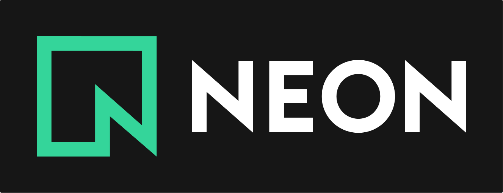

<a href="https://rari.build" target="_blank">
  <picture>
    <source media="(prefers-color-scheme: dark)" srcset=".github/assets/rari-dark.svg">
    <source media="(prefers-color-scheme: light)" srcset=".github/assets/rari-light.svg">
    
  </picture>
</a>

> Runtime Accelerated Rendering Infrastructure

[](https://www.npmjs.com/package/rari)
[](https://opensource.org/licenses/MIT)
[](https://discord.gg/GSh2Ak3b8Q)
[](https://app.codspeed.io/rari-build/rari?utm_source=badge)

**rari** is a React Server Components framework running on a Rust runtime. It has three layers: a Rust runtime (HTTP server, RSC renderer, and router with embedded V8), a React framework (app router, server actions, streaming/Suspense), and a build toolchain (Rolldown-powered Vite bundling, TypeScript 7 type checking). You write standard React, the runtime underneath is Rust instead of Node.

## Features

- **App Router** - File-based routing with layouts, loading states, and error boundaries
- **Server-Side Rendering** - Pre-rendered HTML with instant hydration
- **React Server Components** - Server components by default, client components when you need them
- **Rust-powered runtime** - HTTP server, RSC renderer, and routing written in Rust with embedded V8
- **Zero-config setup** - Works out of the box with pre-built binaries
- **Hot module reloading** - Instant feedback during development
- **node_modules support** - Standard npm package resolution without `npm:` specifier
- **TypeScript-first** - Full type safety across server/client boundary
- **Cross-platform** - Supports macOS, Linux, and Windows
- **Streaming SSR** - Progressive rendering with Suspense boundaries
- **Loading States** - Automatic loading skeletons during navigation

## Quick Start

Create a new rari application in seconds:

```bash
npm create rari-app@latest my-app
cd my-app
npm run dev
```

That's it! Your app will be running at `http://localhost:5173`.

Visit [rari.build/docs](https://rari.build/docs) for complete documentation, guides, and examples.

## Documentation

**[Read the full documentation](https://rari.build/docs)** to learn more about:

- Getting started with rari
- App Router and file-based routing
- Server Components and Client Components
- Server Actions and data mutations
- Streaming SSR and Suspense
- Deployment and production optimization

## Performance

rari delivers exceptional performance that significantly outperforms traditional React frameworks:

### Head-to-Head Comparison vs Next.js

> Benchmarks last updated: August 10, 2026 (rari v0.15.9)

**Response Time (Single Request):**

| Metric          | rari       | Next.js | Improvement      |
| --------------- | ---------- | ------- | ---------------- |
| **Average**     | **0.12ms** | 1.74ms  | **14.5x faster** |
| **P95**         | **0.12ms** | 2.44ms  | **20.3x faster** |
| **Bundle Size** | 287 KB     | 573 KB  | **50% smaller**  |

**Throughput Under Load (50 concurrent connections, 30s):**

| Metric           | rari       | Next.js | Improvement      |
| ---------------- | ---------- | ------- | ---------------- |
| **Requests/sec** | **89,371** | 1,683   | **53.1x higher** |
| **Avg Latency**  | **0.56ms** | 29.73ms | **53.1x faster** |
| **P95 Latency**  | **0.90ms** | 36.70ms | **40.8x faster** |
| **Errors**       | 0          | 0       | Stable           |

**Build Performance:**

| Metric          | rari      | Next.js | Improvement     |
| --------------- | --------- | ------- | --------------- |
| **Build Time**  | **1.12s** | 3.88s   | **3.5x faster** |
| **Bundle Size** | 287 KB    | 573 KB  | **50% smaller** |

**Streaming (`/stream`, Suspense):**

| Metric             | rari    | Next.js | Improvement      |
| ------------------ | ------- | ------- | ---------------- |
| **TTFB**           | **1ms** | 12ms    | **11.1x faster** |
| **First content**  | 107ms   | 108ms   | Comparable       |
| **Last byte**      | 1007ms  | 1009ms  | Comparable\*     |
| **Resolved cards** | 10/10   | 10/10   | Comparable       |
| **Throughput**     | 24.99/s | 24.99/s | 1.0x             |

\*Last-byte time is dominated by intentional ~1000ms card delays, not framework overhead.

All benchmarks are reproducible. See [benchmarks/](https://github.com/rari-build/benchmarks) for methodology and tools.

## Contributing

We welcome contributions! Here's how you can help:

- **Report Bugs** - Found an issue? [Open a bug report](https://github.com/rari-build/rari/issues/new)
- **Suggest Features** - Have ideas? [Share your suggestions](https://github.com/rari-build/rari/discussions)
- **Improve Docs** - Help make our documentation better
- **Submit PRs** - Check out our [Contributing Guide](.github/CONTRIBUTING.md)

## Community

- **Discord** - [Join our community](https://discord.gg/GSh2Ak3b8Q)
- **GitHub** - [Star the repo](https://github.com/rari-build/rari)
- **Documentation** - [rari.build/docs](https://rari.build/docs)

## Sponsors

rari is made possible by the support of these companies:

<div>
  <a href="https://namespace.so" target="_blank">
    <picture>
      <source media="(prefers-color-scheme: dark)" srcset=".github/assets/namespace-dark.svg">
      <source media="(prefers-color-scheme: light)" srcset=".github/assets/namespace-light.svg">
      
    </picture>
  </a>
</div>

**[Namespace](https://namespace.so)** - High-performance cloud infrastructure. CI/CD runners, remote Docker builders, and managed dev environments on bare-metal hardware.

<div>
  <a href="https://get.neon.com/KDQudHN" target="_blank">
    
  </a>
</div>

**[Neon](https://get.neon.com/KDQudHN)** - Serverless Postgres. Autoscaling, branching, and scale to zero.

---

Interested in sponsoring rari? [Get in touch](https://github.com/rari-build/rari/discussions) or support us on [GitHub Sponsors](https://github.com/sponsors/skiniks).

## License

MIT License - see [LICENSE](LICENSE) for details.
